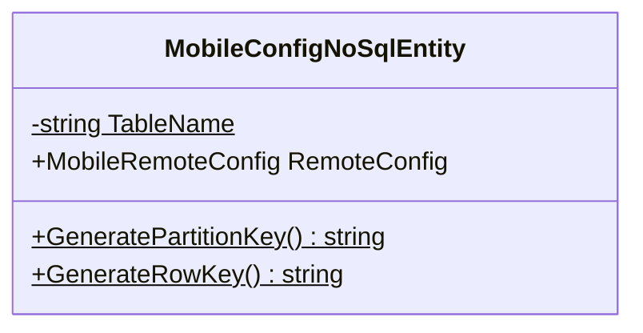
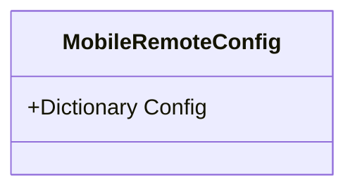

<!-- markdownlint-capture -->
<!-- markdownlint-disable -->

# Code Metrics

This file is dynamically maintained by a bot, *please do not* edit this by hand. It represents various [code metrics](https://aka.ms/dotnet/code-metrics), such as cyclomatic complexity, maintainability index, and so on.

## MyJetWallet.RemoteConfig :heavy_check_mark:

The *MyJetWallet.RemoteConfig.csproj* project file contains:

- 1 namespaces.
- 2 named types.
- 16 total lines of source code.
- Approximately 3 lines of executable code.
- The highest cyclomatic complexity is 2 :heavy_check_mark:.

  <strong id="myjetwallet-remoteconfig">
    MyJetWallet.RemoteConfig :heavy_check_mark:
  </strong>

 

The `MyJetWallet.RemoteConfig` namespace contains 2 named types.

- 2 named types.
- 16 total lines of source code.
- Approximately 3 lines of executable code.
- The highest cyclomatic complexity is 2 :heavy_check_mark:.

  <strong id="mobileconfignosqlentity">
    MobileConfigNoSqlEntity :heavy_check_mark:
  </strong>

 

- The `MobileConfigNoSqlEntity` contains 4 members.
- 8 total lines of source code.
- Approximately 3 lines of executable code.
- The highest cyclomatic complexity is 2 :heavy_check_mark:.

| Member kind | Line number | Maintainability index | Cyclomatic complexity | Depth of inheritance | Class coupling | Lines of source / executable code |
| :-: | :-: | :-: | :-: | :-: | :-: | :-: |
| Method | <a href='https://github.com/MyJetWallet/MyJetWallet.RemoteConfig/blob/master/src/MyJetWallet.RemoteConfig/MobileConfigNoSqlEntity.cs#L8' title='string MobileConfigNoSqlEntity.GeneratePartitionKey()'>8</a> | 100 | 1 :heavy_check_mark: | 0 | 0 | 1 / 1 |
| Method | <a href='https://github.com/MyJetWallet/MyJetWallet.RemoteConfig/blob/master/src/MyJetWallet.RemoteConfig/MobileConfigNoSqlEntity.cs#L9' title='string MobileConfigNoSqlEntity.GenerateRowKey()'>9</a> | 100 | 1 :heavy_check_mark: | 0 | 0 | 1 / 1 |
| Property | <a href='https://github.com/MyJetWallet/MyJetWallet.RemoteConfig/blob/master/src/MyJetWallet.RemoteConfig/MobileConfigNoSqlEntity.cs#L11' title='MobileRemoteConfig MobileConfigNoSqlEntity.RemoteConfig'>11</a> | 100 | 2 :heavy_check_mark: | 0 | 1 | 1 / 0 |
| Field | <a href='https://github.com/MyJetWallet/MyJetWallet.RemoteConfig/blob/master/src/MyJetWallet.RemoteConfig/MobileConfigNoSqlEntity.cs#L7' title='string MobileConfigNoSqlEntity.TableName'>7</a> | 93 | 0 :heavy_check_mark: | 0 | 0 | 1 / 1 |

<a href="#MobileConfigNoSqlEntity-class-diagram">:link: to `MobileConfigNoSqlEntity` class diagram</a>

<a href="#myjetwallet-remoteconfig">:top: back to MyJetWallet.RemoteConfig</a>

  <strong id="mobileremoteconfig">
    MobileRemoteConfig :heavy_check_mark:
  </strong>

 

- The `MobileRemoteConfig` contains 1 members.
- 4 total lines of source code.
- Approximately 0 lines of executable code.
- The highest cyclomatic complexity is 2 :heavy_check_mark:.

| Member kind | Line number | Maintainability index | Cyclomatic complexity | Depth of inheritance | Class coupling | Lines of source / executable code |
| :-: | :-: | :-: | :-: | :-: | :-: | :-: |
| Property | <a href='https://github.com/MyJetWallet/MyJetWallet.RemoteConfig/blob/master/src/MyJetWallet.RemoteConfig/MobileRemoteConfig.cs#L5' title='Dictionary<string, string> MobileRemoteConfig.Config'>5</a> | 100 | 2 :heavy_check_mark: | 0 | 1 | 1 / 0 |

<a href="#MobileRemoteConfig-class-diagram">:link: to `MobileRemoteConfig` class diagram</a>

<a href="#myjetwallet-remoteconfig">:top: back to MyJetWallet.RemoteConfig</a>

<a href="#myjetwallet-remoteconfig">:top: back to MyJetWallet.RemoteConfig</a>

## TestApp :heavy_check_mark:

The *TestApp.csproj* project file contains:

- 1 namespaces.
- 1 named types.
- 24 total lines of source code.
- Approximately 14 lines of executable code.
- The highest cyclomatic complexity is 1 :heavy_check_mark:.

  <strong id="global+namespace">
    &lt;global namespace&gt; :heavy_check_mark:
  </strong>

 

The `<global namespace>` namespace contains 1 named types.

- 1 named types.
- 24 total lines of source code.
- Approximately 14 lines of executable code.
- The highest cyclomatic complexity is 1 :heavy_check_mark:.

  <strong id="program$">
    &lt;Program&gt;$ :heavy_check_mark:
  </strong>

 

- The `<Program>$` contains 1 members.
- 24 total lines of source code.
- Approximately 14 lines of executable code.
- The highest cyclomatic complexity is 1 :heavy_check_mark:.

| Member kind | Line number | Maintainability index | Cyclomatic complexity | Depth of inheritance | Class coupling | Lines of source / executable code |
| :-: | :-: | :-: | :-: | :-: | :-: | :-: |
| Method | <a href='https://github.com/MyJetWallet/MyJetWallet.RemoteConfig/blob/master/src/TestApp/Program.cs#L3' title='<top-level-statements-entry-point>'>3</a> | 70 | 1 :heavy_check_mark: | 0 | 6 | 24 / 7 |

<a href="#global+namespace">:top: back to &lt;global namespace&gt;</a>

<a href="#testapp">:top: back to TestApp</a>

## Metric definitions

  - **Maintainability index**: Measures ease of code maintenance. Higher values are better.
  - **Cyclomatic complexity**: Measures the number of branches. Lower values are better.
  - **Depth of inheritance**: Measures length of object inheritance hierarchy. Lower values are better.
  - **Class coupling**: Measures the number of classes that are referenced. Lower values are better.
  - **Lines of source code**: Exact number of lines of source code. Lower values are better.
  - **Lines of executable code**: Approximates the lines of executable code. Lower values are better.

## Mermaid class diagrams

##### `MobileConfigNoSqlEntity` class diagram

##### `MobileRemoteConfig` class diagram

*This file is maintained by a bot.*

<!-- markdownlint-restore -->
